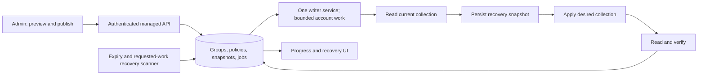

# V1: managed groups, account expiry, and migration

Status: implementation design, 2026-09-19, aligned with [owner decisions](DECISIONS.md). Engineering budgets remain provisional until measured. See [baseline evidence](BASELINE.md), [migration](MIGRATION.md), and [verification](VERIFICATION.md).

## 1. Scope and terminology

A **manager identity** is the administrator's AIOManager login. A **client account** is a managed Stremio account. A **group** owns a published addon configuration shared by its assigned client accounts. Existing saved-addon **profiles** remain library organization; they are not automatically converted into client groups.

V1 must deliver:

- Migration of email and password only, with email as the default display name and a reconciled inventory. No addon setup, library, profiles, rules, auth tokens, or history are imported.
- Custom named groups, ordered addon configurations, one group per account, and separately configured individual addons.
- Automatic initial provisioning and propagation of a published group change to all eligible members.
- Per-account expiry, visible enforcement progress, and renewal.
- Persistent jobs, bounded request rates, recovery from interruptions, snapshots, and operational status.
- Customizable safe mode, enabled by default, with explicitly defined protections for group replacement and expiry.

V1 does not include billing/payment processing, customer login portals, Nuvio, new viewing analytics, or personal recommendation generation. Preserve the base application's account creation and addon customization. Provider-side watch history must not be modified by provisioning or migration.

## 2. Product decisions

| Topic | V1 behavior | Status |
| --- | --- | --- |
| Group membership | One group per active client plus individual addons; unassigned imports remain staged | Confirmed |
| Group control | Published group and personal addons replace the account's setup subject to safe-mode protections | Confirmed |
| Safe mode | On by default, preserving existing protected/default addons including Cinemeta; global default, group override, first-sync choices; changes apply next sync | Confirmed |
| Client changes outside the manager | No new periodic rewriting of ordinary edits on active accounts; preserve existing protection behavior | Confirmed |
| Addon URLs | Identical configured manifest URLs for group members; individual extras are configured separately | Confirmed |
| Publish | Edit draft, then one Publish automatically schedules all eligible members | Confirmed |
| Initial setup | Validate identity and group; first provisioning runs automatically after enrollment | Required behavior |
| Imported clients | Start staged with all outbound changes disabled | Proposed migration safeguard |
| Expiry | Exact date/time in America/New_York; disable every addon, including protected/personal entries, without deleting saved configuration | Confirmed |
| Grace | None; no inferred extra entitlement | Implementation default |
| Renewal | Set future expiry or lifetime; restore current group plus individual configuration; retain account and prior group in Expired system view | Confirmed |
| Missing expiry | No automatic cutoff; show that no expiry has been set | Proposed; never invent dates during migration |
| Lifetime membership | Explicit option with no cutoff, distinct from an unset imported membership; group and personal-addon management continue normally | Confirmed follow-up |
| Ungrouped accounts | Remain unmanaged/staged; no group write | Proposed |
| Account removal | Verify removal of all remote addons before deleting the account record; failed cleanup remains visible and retryable | Confirmed |
| Group deletion | Block deletion with members until reassignment or verified offboarding; never detach and leave paid addons active | Derived safeguard |

The owner has selected full replacement. Any protected-addon exceptions must come from an explicit safe-mode policy evaluated against a fresh remote read. Multiple groups add precedence and ordering rules and should be a separate scope decision before implementation.

## 3. Administrator workflows

### Groups

Create a group from selected saved addons or a reviewed account snapshot. Show credential differences before copying anything. Edit names, URLs/configuration, enabled entries, supported manifest customizations, and order in a draft. A publish preview shows affected members and the additions, removals, configuration changes, and reorders.

These are group-authoring options inside the fork, not requirements to import old addon data. Migrated users can be bulk-assigned to newly configured groups. Safe mode starts enabled and protects the base project's default/manually protected entries, especially Cinemeta. First-sync choices control destructive replacement; disabling safe mode allows relevant removal/reorder/edit operations. Surface the effective collection and exceptions in preview/verification. Safe mode is not a no-write preview mode, and changing it takes effect on the next sync without a separate publication workflow.

Publish creates an immutable revision and schedules all current eligible members. The UI immediately reports queued/running/verified/failed counts. The administrator never needs to open each account to complete the rollout. Later additions to the group use the current revision.

Drafts can be empty. Publishing an empty configuration requires an explicit destructive action and a count of affected accounts. Invalid, unreadable, or partially resolved configurations cannot be published as an empty/partial replacement.

### Accounts

An account form captures email/password or an existing supported provider connection, group, exact expiry, and individual addons. Display name defaults to email. Preserve the existing explicit new-account onboarding flow, including Stremio account creation. Validate the provider identity before activating management. Migration and unattended jobs must never create replacement accounts on failed login.

Assignment/reassignment is a versioned change followed by automatic reconciliation. If a migration/test account already matches the intended state, verify it without rewriting the collection. Account creation remains available during deliberate onboarding, separate from passive import.

For managed accounts, individual addon operations edit the explicit personal-addon layer through the same queue. Preserve customization, catalogs, configured instances, and order; default personal addons after group entries. Duplicate exact URLs or conflicting edits require visible resolution. No hidden second writer may bypass policy.

### Expiry and renewal

Membership controls offer dated or lifetime membership. Unconfigured imports remain
visibly unset, never silently labeled lifetime. Lifetime is stored explicitly with
no expiry fields, not a far-future sentinel date. Switching an expired managed user
to lifetime is a renewal: retain the group and saved addon preferences, advance the
policy version, and reconcile the latest configuration. Switching lifetime to a
dated membership uses the selected New York cutoff, including immediate suspension
if that cutoff is already past. Staged membership edits remain passive.

Store the exact selected date/time, America/New_York timezone, and corresponding UTC cutoff. Do not round to end-of-day or invent an annual anniversary. Reject nonexistent spring-forward wall times; require explicit offset selection for repeated fall-back times. Preview the exact cutoff. Changing the server timezone must not rewrite stored cutoffs.

At cutoff, entitlement is expired even if the scanner has not run yet. All write paths check it. A durable job disables every addon, including protected and individual addons. Retain each saved descriptor, URL, manifest, metadata, catalog configuration, order, and enabled preference; do not delete addons or replace the stored account collection with an empty array. An expiry suspension overrides the effective enabled flag, so renewal can respect manually disabled entries. The provider adapter uses the existing enabled-only payload behavior, yielding an empty active Stremio collection that must be verified. Save encrypted recovery state before the change. Show the account in a computed Expired system group/view while retaining credentials, group assignment, and personal setup.

Renewing changes the cutoff, lifts suspension, and advances the account policy revision. The worker applies the latest group and individual setup, respecting its enabled/disabled preferences. An old snapshot is a recovery option, not the renewal template. A queued expiry action cannot use a superseded policy. Renewal during an in-flight request triggers reconciliation and remains pending until verified.

An enrolled account's expiry policy remains independent of group lookup: a due cutoff can disable addons even if the group is missing. A missing group on an active/renewed account blocks provisioning; it cannot manufacture an empty desired configuration. Staged imports never enforce expiry until activated. Deleting a managed account requires verified remote cleanup first; pending failure keeps credentials and records recoverable. Group transfer is not account deletion.

The owner confirmed disabling addons is sufficient because only the administrator has manifest URLs. Provider credential revocation is out of scope. Device caches or already-playing streams may persist; do not promise forced playback termination or a locked provider login.

## 4. Safety invariants

1. Migration preview and staged accounts generate zero provider writes and zero active legacy rules.
2. Unknown group, failed lookup, missing manifest, or invalid API response never means an empty addon list.
3. Every provider write is authorized for the manager identity and serialized for the actual client identity.
4. No account can receive another client's secret or configuration binding.
5. A stale job cannot mark a newer policy/revision as synchronized.
6. Expired entitlement dominates group installation, restoration, manual edits, and Autopilot.
7. An account is shown as applied only after the expected remote state has been read and verified.
8. Database state, jobs, and snapshots survive normal restarts. An ambiguous remote outcome is verified before another write.
9. Expiry never deletes the client, saved addon records, addon customization, or viewing history. Manual disable preferences survive suspension/renewal.
10. A global write pause prevents new remote writes across every integrated writer; outstanding requests are reported until drained.
11. Preview, errors, logs, and monitoring redact credentials and configured URL secrets.
12. Import and publication are idempotent under repeated requests; a browser retry cannot create duplicate clients or rollouts.

These are application invariants. The remote provider has no established conditional-write contract in this review. External clients and a second manager can still write independently. See the concurrency limitations below.

## 5. Architecture

Keep React and Fastify. Add a cohesive managed-account module rather than replacing the application. The server database becomes authoritative for managed policies and execution. Browser stores are views/caches for those records; a cloud-state pull or stale browser cannot overwrite them.

### Database choice

The deployment stays on the existing VPS Docker/Portainer stack, serving about 40 accounts now and 60-100 next year. Use one application/writer instance and the existing supported database, verifying the actual engine before deployment. No Redis, forced database migration, or horizontal writer scaling is needed for this scale without evidence.

Implement transaction helpers correctly for each supported engine: a dedicated checked-out PostgreSQL connection for a transaction, and explicit SQLite transaction handling. Never use independent pool calls for `BEGIN`, writes, and `COMMIT`. No database transaction stays open during a network request.

### Proposed records

| Record | Main fields and constraints |
| --- | --- |
| Managed client | Manager ID, stable local ID, provider subject ID, encrypted credentials, management state, policy revision, expiry date/timezone/cutoff, suspension/enforcement state, retained addon configuration |
| Group | Manager ID, name, draft version, published revision ID, paused/archive state |
| Group revision | Group ID, revision number, immutable ordered addon entries, payload fingerprint, author/time, explicit-empty authorization |
| Membership | Manager ID, account ID, group ID; unique account membership in V1; same-owner foreign keys |
| Personal addon configuration | Account ID, ordered configured entries, customization, encrypted URLs, revision; shared group URLs remain identical in V1 |
| Deployment | Published revision, intended cohort, progress, superseded/cancelled state |
| Job | Account ID, desired policy/revision identity, cause, state, attempts, next attempt, lease, redacted last error |
| Snapshot | Account ID, before-write collection, digest, timestamp, source job, encryption key version |
| Migration batch | Source format/digest, staged inventory, original-ID mapping, validation report, activation state |
| Audit event | Actor, account/group, action, policy/revision/job IDs, timestamp, redacted outcome |

Index due jobs, due expiries, owner/group membership, and active account jobs. Enforce uniqueness for provider identity within an owner and prevent duplicate management of the same external identity by multiple writers within the deployment. Reject conflicting ownership rather than silently merging. Store full-configuration digests as keyed hashes where secrets are involved; never expose them as substitute credentials.

### Authentication and secrets

Use server-verified administrator identity/authorization for all managed routes. Scope records, jobs, and credential lookup by that identity. An account ID or a client-supplied context header is not proof of ownership. Session/token strategy must be chosen after reviewing the current deployment's authentication; include CSRF/origin checks if cookies are used.

Unattended operation requires server decryption of enrolled credentials and configured URLs. Explain this during enrollment. Store the requested imported passwords and runtime auth keys in authenticated, versioned encrypted envelopes; prefer valid tokens for routine calls. Protect and back up encryption keys separately. Never trim passwords. Missing keys stop work visibly and must not trigger replacement keys over unreadable data.

### API boundaries

Proposed managed endpoints: group draft/preview/publish; account enrollment/assignment/expiry/renewal; migration validate/stage/activate; deployment status; retry/pause; and restore preview/execute. Mutations use request idempotency keys and expected record versions. Return a conflict when a preview is stale. Browser disconnects do not cancel committed work.

Publishing a revision and its durable deployment marker commit in one transaction. For large cohorts, expand deployment jobs in resumable pages with unique job keys. A reconciliation scan detects members whose applied revision differs from desired, closing any gap after restart. Enrollment concurrently with publication resolves to the latest committed revision.

## 6. Worker and provider adapter

Provisional starting limits: three concurrent account jobs, one writer per actual provider account, and two Stremio requests per second with a small bounded burst. These are conservative implementation defaults, not claimed provider rate limits. Measure and tune on the target host. All managed paths, legacy integrations, and future metrics share provider budgets; expiry/renewal receive priority with fairness for ordinary work.

Execution sequence:

1. Atomically claim a due job with a lease; load current membership, policy, credentials, and published revision.
2. Determine effective entitlement using current time. Superseded work resolves to the latest desired state or exits without writing.
3. Resolve/validate the complete desired collection. Fetch each distinct shared manifest once per needed revision; isolate account-specific URLs/cache keys. A failed required manifest prevents publication or blocks only the affected enrollment, leaving remote state intact.
4. Read and validate the current remote collection. If it already matches, record verified completion without a write.
5. Persist an encrypted snapshot and write intent. Recheck policy, write pause, and account ownership immediately before dispatch.
6. Apply the complete collection in one provider operation. Do not uninstall and reinstall entries one at a time.
7. Perform bounded delayed reads and compare transport URLs, relevant manifest configuration, and order. Ignore only explicitly documented provider-normalized fields.
8. Commit the observed outcome against the job's policy revision. If the policy changed, enqueue the newest reconciliation and show pending, not current.

URL comparison must preserve case-sensitive paths, query values, and config tokens. Addon name, manifest ID/version, a trailing `manifest.json`, or list length is not a unique configuration identity. Keep different configured instances of the same addon distinct. Custom Cinemeta resources/catalog settings are part of the tested payload contract.

### Retries, crashes, and concurrent changes

- Retry network errors, selected 5xx responses, and 429s with bounded exponential backoff/jitter. Respect both forms of `Retry-After`. Persist the next attempt across restart.
- Invalid credentials become action-required; do not create replacement accounts or repeatedly log in.
- A timeout after dispatch means outcome unknown. Read current remote state before retrying, including after process restart.
- Proposed fast retry budget: five attempts, followed by a visible failure and rate-limited later reconciliation. Expiry stays overdue until verified; periodic scans must not generate a retry storm.
- A provider-wide failure opens a circuit breaker. Jobs remain pending; successful accounts remain recorded individually. Partial rollout is visible.
- Lease ownership/fencing protects local job state. It cannot cancel an already accepted remote request. V1 requires one active writer service, bounded request timeouts, graceful drain, and conservative recovery of ambiguous writes. Do not claim exactly-once external execution.
- A setting changed during a remote call may require a corrective follow-up write. Tests must prove eventual convergence and accurate pending status, including expiry racing renewal.
- A second legacy instance or Stremio device may overwrite state outside our lock. Cutover requires disabling competing automation. Do not periodically reverse ordinary active-client changes; only recover requested work or enforce expiry. Devices are not controlled transaction participants.

## 7. Existing writer integration

Inventory and gate every path that calls collection-set: account edits, bulk actions, saved-addon propagation, URL replacement, manifest customization, Autopilot, and restoration. The generic proxy must not let old clients bypass managed policy. Credential identity must be resolved server-side; it must not trust a browser's claimed account ID.

Migration ignores legacy addon/Autopilot/restoration rules. Initial V1 activation must disable competing writers in the original running manager. Preserve the base's failover/restoration features, configuring them afresh as subordinate policy inputs through the same queue, snapshots, safe-mode policy, expiry gate, and verification. Do not migrate rules or let legacy automation re-enable suspended accounts.

Keep existing unmanaged behavior isolated. Managed fields are not writable by the old encrypted-cloud merge routine. A stale tab receives a clear management/version conflict and reloads the authoritative state.

## 8. Scheduling and operational visibility

Run an indexed expiry scan at startup and approximately every 30 seconds. Scanning and enqueueing are idempotent. Staged accounts are excluded. All execution still checks the current cutoff, independent of the scanner. Recovery after downtime processes overdue accounts without losing their original deadlines.

Use event-driven reconciliation after publication, assignment, individual-addon changes, explicit sync, or renewal. Periodic recovery handles incomplete requested jobs, not blanket enforcement of active-account drift. Expired accounts cannot be restored by any manager path; failed expiry stays overdue and retryable. Observed removal time and device refresh time are different measurements.

Dashboard: desired/applied revision, verification time, queued/running/retrying/action-required counts, overdue expiry count and oldest age, last successful worker scan, and a global write pause. Distinguish active membership from successful provisioning. Errors include a useful next action without exposing keys.

Take automatic daily encrypted backups of the database and matching key/recovery material; keep encrypted pre-write snapshots for individual recovery. Test restoration separately with writes disabled. A daily schedule permits up to a day of management-data loss; do not claim hourly recovery points. Finalize retention/destination in deployment rehearsal and measure restoration time.

## 9. Delivery sequence and completion gates

| Milestone | Work | Evidence needed to proceed |
| --- | --- | --- |
| M0: behavior and capability | Resolve critical questions; inventory installed version; disposable-account probes for disable-all/re-enable, custom manifests, auth, device refresh | Signed-off behavior and provider fixtures; saved disabled addons survive sync/restart while remote active collection is empty |
| M1: trustworthy baseline | Resolve lint; triage/update dependencies; extract testable server startup; add CI; reproducible fork-owned images | Build/lint/tests pass; runtime starts against empty test DB; reviewed dependency report; no upstream publishing target |
| M2: durable foundations | Versioned DB migrations, transaction helpers, server ownership/auth, encrypted records, jobs, snapshots, pause switch | Restart, duplicate delivery, tenancy, failure, and key-loss tests pass with writes simulated |
| M3: migration rehearsal | Passive email/password importer, duplicate/conflict detection, encrypted staging, bulk group assignment, backup/restore | Zero-write import tests; repeat import idempotency; credential inventory reconciles; ignored addons create no dependency |
| M4: managed groups | Group UI and publish preview, personal addons, first provisioning, worker/provider integration, existing-writer gates | Mock 40/100-account rollouts and all group acceptance scenarios pass; disposable accounts verify actual behavior |
| M5: expiry and renewal | Date/timezone UI, indexed scanner, suspension/verification, renewal, priority and race handling | Boundary, restart, stale-job, partial failure, renewal tests; no account/addon/history deletion; manual disabled preferences preserved |
| M6: release rehearsal | Performance/soak, target database and container, encrypted restore, rollback, device matrix | All [release gates](VERIFICATION.md) pass on the intended environment |
| M7: controlled cutover | Test accounts, small client cohort, then group-sized waves | Reviewed account diffs, observed stability, complete verification and recoverable snapshots |

Keep changes reviewable by separating behavior tests, persistence, API/worker logic, UI, and migration adapters into focused commits/PRs. Each work item records its failure modes and evidence. Do not publish all features as one unreviewed patch or deploy automatically from the planning branch.

## 10. End-to-end acceptance examples

- Assign a fresh account to Group A: it receives A's ordered, credential-correct configuration without manual per-account addon actions.
- Add an addon to A and publish once: all 40 eligible members converge; the dashboard reports partial failures accurately and retries them.
- Reorder without changing URLs: every member receives the new order.
- Publish again while the previous rollout is active: accounts end on the newest revision; older jobs cannot claim that revision was applied.
- Move an account to Group B mid-rollout: it ends on B, with no A job continuing to manage it.
- Set an expiry and close the browser: disabling is still attempted at cutoff and verified, or an overdue/error state is recorded. Saved addons and their configuration remain visible and recoverable.
- Renew while disabling is queued/in progress: the latest policy determines final state, intentionally disabled entries remain disabled, and the UI does not claim completion prematurely.
- Import existing emails/passwords: counts and exact credentials reconcile, names default to email, other fields are ignored, and import alone sends no provider writes or registration requests.
- Keep an individual testing addon: publishing the group preserves it and its custom metadata/catalogs; expiry disables it and protected addons without deleting their saved configuration.
- Delete a client while the provider is unavailable: retain a cleanup-pending record and credentials; delete only after an empty remote collection is verified.
- Activate an imported account: the newly configured group replaces its addons according to the visible safe-mode policy; no old addon export is needed.
- Recover from a failed rollout or server restart: work resumes from durable state; restoration is previewed and uses the same worker rules.
